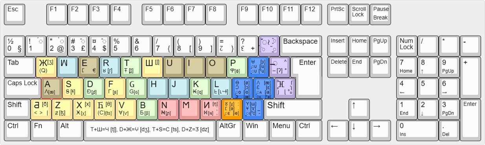

# Universal Eurocentric Alphabet ЖꟽERЧ v0.72 - ʒwertʃ - Jwertch - Жўерч - Ζωερτςς - झ़वएरच - জৱএরথশ - ჟვერჩ - ջվեռՃ - ㅈㅞㄹㅊ - ጀዌረቸ
**Every writing system is equally descriptive and prescriptive**

The official IPA (International Phonetics Association) symbols are useful for academic accuracy, but utterly useless for practical writing purposes like an alphabet of a language. To represent every base vowel of, practically, all languages the Standard Latin Alphabet with 6 letters generally used for vowels (A, E, I, U, O, Y) would only need another 6 additional vowel letters: Ʌʌ, Ɵɵ, Ʉᵾ, Ɔɔ, Ɛɛ and Ⳟⳟ. Marginal cases would be covered by adding two more vowel letters: Ұ & Э. Similarly, 46 base consonants sufficiently describe the sounds of the vast majority of the world's languages.
## Notable features
- Latin-Greek-Cyrillic-based and IPA inspired alphabet with 14 vowels and 46 consonants and 9 articulatory modifiers constituting altogether about 300 possible combinations or, independent graphemes.
- Used to write every language in the past, present and, hopefully, future.
- Keyboard configuration: All 60 base letters configurable on most QWERTY and AZERTY variants, of which 24 require two inputs.
- All 300 letters typeable with not more than 3 inputs using 3 modifier keys.
- All novel letters were designed to require the *least number of inputs* without sacrificing graphic harmony and unity between the letters.
- The sounds represented by each letter are the initial sounds of the things they depict, using the acrophonic principle.
## Vowels
The vowel systems of practically all languages can be described with three principal categories: rectangular, triangular, and vertical. {Ʉ} & {Ɵ} occur often as pairs. Same is often true for {Y} & {Ⳟ} and {Ɛ} & {Ɔ}. Extremely rarely does one language distinguish both pairs, {Ʉ} & {Ɵ} and {Ɛ} & {Ɔ}. 

| Rectangular   | Front    | Back     | --- | Triangular    | Front | Central | Back  | --- | Vertical      | Central |
| :---          | :---:    | :---:    | --- | :---          | :---: | :---:   | :---: | --- | :---          | :---:   |
| **Close**     | I \| *Ʉ* | *Y* \| U | --- | **Closed**    | I     |   *Y*   | U     | --- | **Closed**    |    Y    |
| **Close-mid** |          |          | --- | **Close-mid** | E     |         | O     | --- | **Close-mid** |         |
| **Mid**       | E \| *Ɵ* | *Ⳟ* \| O | --- | **Mid**       |       |   *Ⳟ*   |       | --- | **Mid**       |   *Ⳟ*   |
| **Open-mid**  |          |          | --- | **Open-mid**  | *Ɛ*   |         | *Ɔ*   | --- | **Open-mid**  |         |
| **Open**      |    Ʌ     |    A     | --- | **Open**      |       |    A    |       | --- | **Open**      |    A    |

### Vowel systems

#### Other vowel systems

**Khmer** has 10 base vowels.
| French        | Front   | Back  | --- | Khmer         | Central | Front | Central |
| :---          | :---:   | :---: | --- | :---          | :---:   | :---: | :---:   |
| **Closed**    | I \| Ʉ  |   U   | --- | **Closed**    |    I    |   Y   |    U    |
| **Close-mid** | E \| Ɵ  |   O   | --- | **Close-mid** |    E    |       |    O    |
| **Mid**       |         |       | --- | **Mid**       |         |   Ⳟ   |         |
| **Open-mid**  |   Ɛ     |   Ɔ   | --- | **Open-mid**  |    Ɛ    |       |    Ɔ    |
| **Open**      |   Ʌ     |   A   | --- | **Open**      |    A    |       |    Ʌ    |

### Transphonologization
Diacritics representing [nasalization](https://en.wikipedia.org/wiki/Nasalization), [tone](https://en.wikipedia.org/wiki/Tone_(linguistics)), and [stress](https://en.wikipedia.org/wiki/Stress_(linguistics))/[pitch](https://en.wikipedia.org/wiki/Pitch-accent_language) typeable with the upper modifier key (◌̣̌≀): ◌̰̃, ◌̭̌ (toggle) and ◌̣̇, respectively. On keyboard, tone diacritics have a toggleable priority, since they share the horizontal numerical keys with numbers. Nasalization and stress/pitch are binary features (on or off). At least one of these three features is phonemic in about half of the world's langs. Depending on the selected language one of these features is configured to first priority for the modifier key: Tone toggle for Mandarin, nasalisation for Hindi, and stress/pitch for Russian (should they care to mark it since it's phonemic) for example. One grapheme box (the space a symbol occupies on a row) fits two diacritics, one above and one below. Trying to fit any more will produce problems with rendering.

Tonality
- vertical line above {◌̄} for a high tone
- vertical line below {◌̠} for a low tone
- acute accent {◌́} for a rising tone
- grave accent {◌̀} for a falling tone
- caron {◌̌} for a dipping tone
- circumflex {◌̂} for a peaking tone
- among others for unique tones in certain languages.

## Consonants
### Consonant Chart

{H} and {‒} are unique. {H} is best analyzed as the only voiceless approximant. Other approximants are always voiced. {H} does **not** have an inherent *place* or *manner* of articulation. Some linguists analyze it as a voiceless vowel, whose pronunciation is defined by the surrounding sounds. Similarly, the glottal stop, {‒} [ʔ], is simply a suspension between sounds. Correspondingly, the epiglottal consonants, {H̥} & {Ɨ̥}, have a wide range of articulations even within one language. 
### Uncommon phonemes
Typeable with the central modifier key {◌̶ } that adds a strikethrough bar to most base letters. For example, inputting {◌̶ } and {K} outputs {₭}.

**Uvular consonants**: several langs distinguish at least one uvular consonant, usually {₭} [q]. These are analysed in contrast to their velar counterparts:
|        | Nasal | Plosive        | Fricative          |
| :---:  | :---: | :---:          | :---:              |
| Velar  | И [ŋ] | K [k] \| 𝖦 [g] | X [x] \| 𑄷 [ɣ]     |
| Uvular | Ⳮ [ɴ] | ₭ [q] \| G [ɢ] | Ӿ [χ] \| ~~૪~~ [ʁ] |

**Dental consonants**: a few langs distinguish [n],[t],[d] at two adjacent places of articulation, dental and alveolar: [Ꞥ}, {Ŧ}, {Ð} <=> {N}, {T}, {D}, respectively. In comparison, phonemic distinction of the non-sibilant dental fricatives [θ] & [ð] is much more common, hence the dedicated symbols, {Ⴌ} & {Ƌ}.

**Lateral alveolar fricatives, Ꞩ [ɬ] & Ƶ [ɮ]**: Common among Bantoid, Tibeto-Burman, Zhuang, Hmongic, Native American, Caucasian langs and Welsh.

**Lateral velar/uvular approximant [ʟ] or velarized alveolar approximant [ɫ], ᖶ**: Somewhat rare excluding allophony e.g. before back vowels. Present in Kurdish, Albanian, Papuan langs, Berberic, and maybe Turkish.

**Voiceless alveolar trill, ᖉ [r̥]**: a rare gem. Present in Tibetan, Chechen, Ingush, Welsh, Moksha, and possibly Icelandic.

**Bilabial Ⴔ [ɸ] & Ƃ [β] vs labiodental F [f] & B [v] fricatives**: common allophones. The largest language by native speakers to contrast the two pairs is Ewe at 4 mil (2021).

**Labial trills, Γ [ʙ̥] & Ɐ [ʙ]**: extremely rare. Present in some Native American, Oceanic, Bantoid, Papuan, and Tibeto-Burman langs.

## Articulatory Modification
Most languages exhibit certain geographically distinctive features, which allow a kind of grouping. This becomes evident, when comparing the *places of articulation* (PoA) of their phonemes. Three of them are practically universal: labial, alveolar, and velar. Distinguishing consonants at dental PoA in contrast to its surrounding PoA, labial and alveolar, seems to occur sporadically across language families and regions, which excludes it as a grouping factor. The post-alveolar fricatives, {Ш} [ʃ], {Ж} [ʒ] and affricates {Ч} [tʃ], {ⵖ} [dʒ]  are near universal, hence they have dedicated symbols. Other uvular phonemes than {₭} [q] are rare, although {₭} [q] appears often among different language families. This leaves three distinctive PoA: palatal, retroflex, and epiglottal (see velarization) - analysed below.

In some cases, there is a distinctive *manner of articulation*. [Ejective](https://en.wikipedia.org/wiki/Ejective_consonant) and [implosive](https://en.wikipedia.org/wiki/Implosive_consonant) consonants constitute the glottalic consonants. There is also the issue of contrastive non-modal voicing of vowels. [Creaky-voiced](https://en.wikipedia.org/wiki/Creaky_voice) vowels are analysed as glottalic vowels. [Breathy-voicing](https://en.wikipedia.org/wiki/Breathy_voice) is analysed as [aspiration](https://en.wikipedia.org/wiki/Aspirated_consonant) in consonants. A few langs, however, contrast two sets of vowels, modal voiced and breathy voiced. Finally, there are the elusive click consonants in some African langs.

The articulatory modifications are typeable on the keyboard with the lower modifier key, (ⴼ̥̊):
- [Palatalization](https://en.wikipedia.org/wiki/Palatalization_(phonetics)): {◌ȷ} [◌ʲ]
- [Retroflex](https://en.wikipedia.org/wiki/Retroflex_consonant): {ɭ◌}
- [Velarization](https://en.wikipedia.org/wiki/Velarization): {◌̥} [◌ˠ]
  - [Uvularization](https://en.wikipedia.org/wiki/Uvularization): [◌ʶ]
  - [Pharyngealization](https://en.wikipedia.org/wiki/Pharyngealization): [◌ˤ]
- [Glottalization](https://en.wikipedia.org/wiki/Glottalic_consonant): {ſ◌} [◌ʼ]
  - [Creaky-voiced](https://en.wikipedia.org/wiki/Creaky_voice): {ſ◌} [◌̰]
- [Aspiration](https://en.wikipedia.org/wiki/Aspirated_consonant): {◌ʜ} [◌ʱ]
  - [Breathy-voicing](https://en.wikipedia.org/wiki/Breathy_voice): {◌ɿ} [◌̤]
- [Clicks](https://en.wikipedia.org/wiki/Click_consonant): {◌̊} [ʘ], [ǀ], [!], [!!], [ǂ]

## Sample text
Vsi ljudi rodęt sę svobodni i råvni v dostojnosti i pravah. Oni sųt obdarjeni råzumom i svěstjų i imajųt postųpati jedin k drugomu v duhu bratstva.
(Iz Universalnoj Deklaracije Prav Člověka, členòk 1)
### Transliteration
Vsı ̡ʟᴜᴅı ʀoᴅᴇᴛ sᴇ svoʙoᴅɴı ı ʀᴀvɴı v ᴅosᴛoᴊɴosᴛı ı ᴘʀᴀvᴀx. Oɴı sᴜᴛ oʙᴅᴀʀᴊᴇɴı ʀᴀzᴜᴍoᴍ ı svıᴇsᴛᴊᴜ ı ıᴍᴀᴊᴜᴛ ᴘosᴛᴜᴘᴀᴛı ᴊᴇᴅıɴ κ ᴅʀᴜԍoᴍᴜ v ᴅᴜxᴜ ʙʀᴀcᴛvᴀ.
(Iz Uɴıvᴇʀsᴀʟɴoᴊ Dᴇκʟᴀʀᴀcıᴊᴇ Pʀᴀv Чʟovıᴇκᴀ, чʟᴇɴoκ 1)
## Phonetic Super Families

[The Map](https://www.google.com/maps/d/viewer?hl=fi&mid=1bwVF83mYLI8nQO9N-99FfQoBWDlmaaE&ll=18.001273675835744%2C0&z=1)
## Keyboard Configuration

