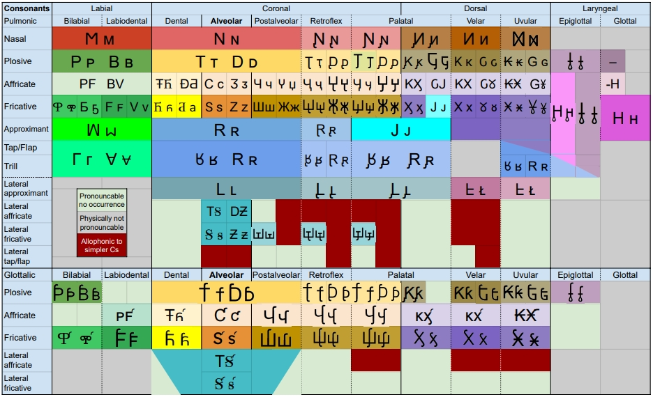
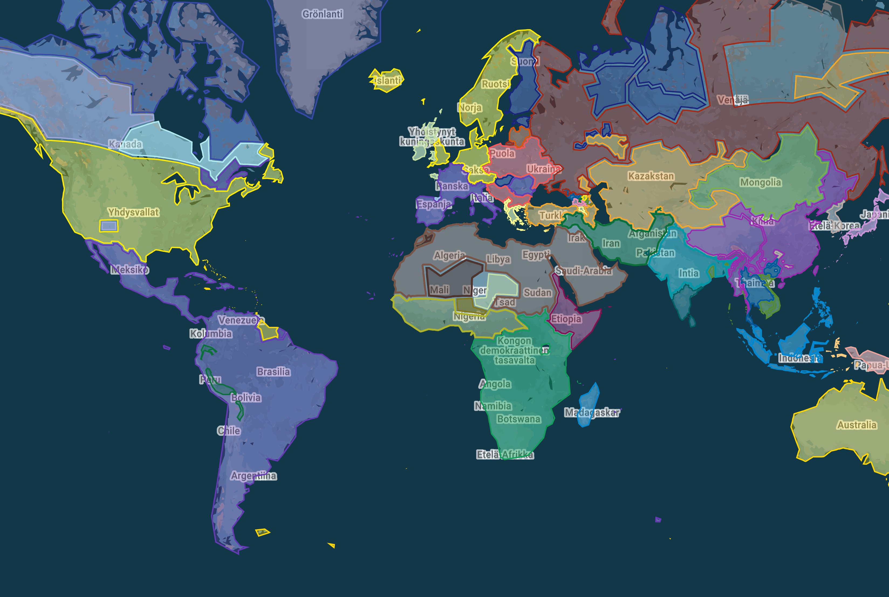
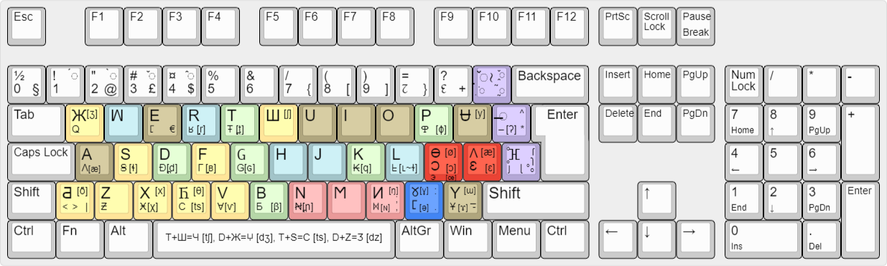

# Universal Eurocentric Alphabet ЖꟽERЧ v0.72 - ʒwertʃ - Jwertch - Жўерч - Ζωερτςς - झ़वएरच - জৱএরথশ - ჟვერჩ - ջվեռՃ - ㅈㅞㄹㅊ - ጀዌረቸ
**Every writing system is equally descriptive and prescriptive**

The official IPA (International Phonetics Association) symbols are useful for academic accuracy, but utterly useless for practical writing purposes like an alphabet of a language. To represent every base vowel of, practically, all languages the Standard Latin Alphabet with 6 letters generally used for vowels (A, E, I, U, O, Y) would only need another 6 additional vowel letters: Ʌʌ, Ɵɵ, Ʉᵾ, Ɔɔ, Ɛɛ and Ⳟⳟ. Marginal cases would be covered by adding two more vowel letters: Ұ & Э. Similarly, 46 base consonants sufficiently describe the sounds of the vast majority of the world's languages.
## Notable features
- Latin-Greek-Cyrillic-based and IPA inspired alphabet with 14 vowels and 46 consonants and 9 articulatory modifiers constituting altogether about 300 possible combinations or, independent graphemes.
- Used to write every language in the past, present and, hopefully, future.
- Keyboard configuration: All 60 base letters configurable on most QWERTY and AZERTY variants, of which 24 require two inputs.
- All 300 letters typeable with not more than 3 inputs using 3 modifier keys.
- All novel letters were designed to require the *least number of inputs* without sacrificing graphic harmony and unity between the letters.
- The sounds represented by each letter are the initial sounds of the things they depict, using the acrophonic principle.
## Vowels
The vowel systems of practically all languages can be described with three principal categories: rectangular, triangular, and vertical. {Ʉ} & {Ɵ} occur often as pairs. Same is often true for {Y} & {Ⳟ} and {Ɛ} & {Ɔ}. Extremely rarely does one language distinguish both pairs, {Ʉ} & {Ɵ} and {Ɛ} & {Ɔ}. 

| Rectangular   | Front    | Back     | --- | Triangular    | Front | Central | Back  | --- | Vertical      | Central |
| :---          | :---:    | :---:    | --- | :---          | :---: | :---:   | :---: | --- | :---          | :---:   |
| **Closed**    | I \| *Ʉ* | *Y* \| U | --- | **Closed**    | I     |   *Y*   | U     | --- | **Closed**    |    Y    |
| **Close-mid** |          |          | --- | **Close-mid** | E     |         | O     | --- | **Close-mid** |         |
| **Mid**       | E \| *Ɵ* | *Ⳟ* \| O | --- | **Mid**       |       |   *Ⳟ*   |       | --- | **Mid**       |   *Ⳟ*   |
| **Open-mid**  |          |          | --- | **Open-mid**  | *Ɛ*   |         | *Ɔ*   | --- | **Open-mid**  |         |
| **Open**      |    Ʌ     |    A     | --- | **Open**      |       |    A    |       | --- | **Open**      |    A    |

### Vowel systems
#### Rectangular vowel system
**Rectangular vowel systems** (I, E, Ʌ, A, O, U) are common across the entire continent of Eurasia: Germanic, Uralic, Turkic, Indo-Iranian, Tibetic, Wu, many NE-Caucasian languages and Sinhala. Possibly true also for Ethio-Semitic languages, Korean and some Slavic languages depending on analysis.

**Ge'ez**, one of the oldest written languages in the Horn of Africa, though today only used as the main liturgical language in some Ethiopian and Eritrean churches, had the six vowel system and a central vowel {Y} [ɨ]. This fact is reflected to this day in the romanization of Ethio-Semitic languages in the transcription of {Ʌ} with 'Ä', whose pronunciation today ranges from [æ] to [ɐ].

Not all **Koreans** distinguish ㅔ[e] from ㅐ[ɛ], latter of which is often, notably, romanized as 'ae'. Indeed, the phonemes seem to be in a process of merging.

**Slavs** stand at a precipice. Arguably, palatalization tends to front the subsequent central vowel [ä]➝[æ] and back vowels, [o]➝[ɵ], [u]➝[ʉ], [ɨ]➝[i]. The Polish solved this by writing 'CiV' as in 'niania' [nʲænʲæ], 'siostra' [sʲɵstra], and 'dniu' [dnʲʉ]. Russians took an opposite approach using the Cyrillic script and embedded the process of palatalizing the preceding vowel into five letters, Я [ʲæ], Ё [ʲɵ], Ю [ʲʉ], Е [ʲe], И [ʲi] such as 'няня' [nʲænʲæ], 'сёстра' [sʲɵstra], and 'дню' [dnʲʉ]. Ukrainians, Belarusians, and Bulgarians took a similar approach. These five languages also distinguish a central vowel {Y} [ɨ], which is transcribed in Latin with 'y'. Interestingly, Slovaks transcribe [æ] with 'Ä'.
| English | Slovene | Croatian | Czech  | Slovak  | Polish    | Ukrainian | Russian | Belarusian | Bulgarian | Serbian | Macedonian |          |
| :---    | :---:   | :---:    | :---:  | :---:   | :---:     | :---:     | :---:   | :---:      | :---:     | :---:   | :---:      | :---     |
| smell   | vonj    | njuh     | ňuch   | ňuch    | węch      | нюх       | нюх     | нюх        | нюх       | њух     | мирис      |          |
| IPA     | voɲ     | ɲʉx      | ɲʉx    | ɲʉx     | vex       | ɲʉx       | ɲʉx     | ɲʉx        | ɲʉx       | ɲʉx     | miris      | [u]➝[ʉ] |
| aunt    | tetka   | tetka    | tetka  | tetka   | ciocka    | тітка     | тётка   | цётка      | тетка     | тетка   | тетка      |          |
| IPA     | tetka   | tetka    | tetka  | tetka   | t͡sʲɵt͡sʲka | tʲitka    | tʲɵtka  | t͡sʲɵtka    | tetka     | tetka   | tetka      | [o]➝[ɵ] |
| will    | volja   | volja    | vůle   | vôľa    | wola      | воля      | воля    | воля       | воля      | воља    | волја      |          |
| IPA     | voʎæ    | voʎæ     | vu:le  | vʊoʎæ   | vola      | voʎæ      | voʎæ    | voʎæ       | voʎæ      | voʎæ    | voʎæ       | [ä]➝[æ] |
|         |         |          |        |         |           |           |         |            |           |         |            |          |

Rectangular 6-vowel system is present across major branches and families in:
- **Indo-Aryan**: Sinhala
- **Slavic**: Slovak and probably Czech
- **Indo-Iranian**: Iranian, Dari, Tajik

Rectangular 7-vowel system that distinguishes *one* unrounded central or back vowel, {Y} or {Ⳟ}:
- **Indo-Iranian**: Pashto, Ossetian
- **Tibeto-Burman**: Loloish
- **Ethio-Semitic**: Amharic, Tigrinya
- **Hmong-Mien**: Iu Mien

Rectangular 8-vowel system that distinguishes *both* rounded front vowels, {Ʉ} & {Ɵ}:
- **Germanic**: All but the Dutch
- **Tibeto-Burman**: Tibetan, Dzongkha
- **Uralic**: Hungarian, Finnish
- **NW-Caucasian**: Chechen, Ingush

Rectangular 8-vowel system that distinguishes *both* unrounded central or back vowels, {Y} or {Ⳟ}:
- **Indo-Aryan**: Kashmiri

Rectangular 9-vowel system that distinguishes *both* rounded front vowels {Ʉ} & {Ɵ}, and *one* unrounded central or back vowel, {Y} or {Ⳟ}:
- **Slavic**: Russian, arguably, and probably Belarusian
- **Turkic**: All but Uzbek
- **Uralic**: Estonian, Mari, Udmurt, Moksha

Rectangular 10-vowel system that distinguishes *both* rounded front vowels {Ʉ} & {Ɵ}, and *both* unrounded central or back vowels, {Y} or {Ⳟ}:
- **Sinitic**: Wu languages

#### Triangular vowel system

**Arabic and Berberic** languages distinguish only three vowels: I, A, U, which have a wide range of allophones.

Triangular 5-vowel system is probably the most common vowel system. Across major branches and families it's present in:
- **Romance**: Spanish & Italian
- **Slavic**: Balkan Slavic languages
- **Dravidian**: Telugu, Tamil,	Kannada
- **Indo-Iranian**: Kurdish
- **Paleo-Balkan**: Greek

Triangular 6-vowel system that distinguishes *one* unrounded central or back vowel, {Y} or {Ⳟ}:
- **Sinitic**: Hokkien, Teochew, Hakka
- **Slavic**: Polish, Ukrainian, Bulgarian
- **Austronesian**: Javanese, Madurese
- **Dravidian**: Malayalam, Kodava, Tulu
- **Kra-Dai**: Zhuang, Bouyei
- **Tibeto-Burman**: Meitei
- **Paleo-Balkan**: Armenian
- **American**: Guarani, Arawakan
- **Hmong-Mien**: Hmong
- **Caucasian**: Dargwa
- **Celtic**: Welsh

Triangular 7-vowel system that distinguishes *both* the near-close {E} & {O} and the near-open {Ɛ} & {Ɔ} vowels:
- **Romance**: Portuguese, maybe French (see details below)
- **Indo-Aryan**: The majority except for Marathi, Odia, Nepali, Sinhala, and Chhattisgarhi
- **Bantoid**: Gikuyu, Lingala, Sepedi
- **West-African**: Yoroba, Manding langs
- **Nilotic**: Nobiin, Maasai, Dinka

Triangular 7-vowel system that distinguishes *both* unrounded central or back vowels, {Y} & {Ⳟ}
- **Romance**: Romanian
- **Austronesian**: Sundanese
- **Korean**: For some speakers
- **Tibeto-Burman**: Nyishi
- **Indo-Iranian**: Wakhi
- **Saharan**: Kanuri
- **Oto-Manguean**: Otomi

Triangular 8-vowel system that distinguishes *both* the near-close {E} & {O} and the near-open {Ɛ} & {Ɔ} vowels, and *one* unrounded central or back vowel, {Y} or {Ⳟ}:
- **Austroasiatic**: Santali
- **Tibeto-Burman**: Burmese
- **West-African**: Ewe, Wolof

Triangular 9-vowel system that distinguishes *both* the near-close, {E} & {O} and the near-open {Ɛ} & {Ɔ} vowels, and *both* unrounded central or back vowels, {Y} & {Ⳟ}:
- **Austroasiatic**: Vietnamese, Mon
- **Kra-Dai**: Thai, Shan, Lao
- **Tibeto-Burman**: Karenic

Triangular vowel systems that distinguish a rounded close front vowel, {Ʉ}:
- **Sinitic**: Mandarin, Jin (Also *both* unrounded central and back vowels, {Y} & {Ⳟ}) and Cantonese (Also a rounded mid front vowel, {Ɵ})
- **Paleo-Balkan**: Albanian (Also *one* unrounded mid central or back vowel, {Ⳟ})
- **Tungusic**: Xibe (Also a rounded mid front vowel, {Ɵ})
- **Mongolic**: Mongolian (Also a rounded mid front vowel, {Ɵ})

#### Vertical vowel system
Rare outside of NW-Caucasian and marginal Chadic languages. Often compensated with strong labialization and/or palatalization. Front and back vowels occur as allophones.
#### Other vowel systems
**French** is cursed

**Khmer** has 10 base vowels.
| French        | Front   | Back  | --- | Khmer         | Central | Front | Central |
| :---          | :---:   | :---: | --- | :---          | :---:   | :---: | :---:   |
| **Closed**    | I \| Ʉ  |   U   | --- | **Closed**    |    I    |   Y   |    U    |
| **Close-mid** | E \| Ɵ  |   O   | --- | **Close-mid** |    E    |       |    O    |
| **Mid**       |         |       | --- | **Mid**       |         |   Ⳟ   |         |
| **Open-mid**  |   Ɛ     |   Ɔ   | --- | **Open-mid**  |    Ɛ    |       |    Ɔ    |
| **Open**      |   Ʌ     |   A   | --- | **Open**      |    A    |       |    Ʌ    |
### Transphonologization
Diacritics representing [nasalization](https://en.wikipedia.org/wiki/Nasalization), [tone](https://en.wikipedia.org/wiki/Tone_(linguistics)), and [stress](https://en.wikipedia.org/wiki/Stress_(linguistics))/[pitch](https://en.wikipedia.org/wiki/Pitch-accent_language) typeable with the upper modifier key (◌̣̌≀): ◌̰̃, ◌̭̌ (toggle) and ◌̣̇, respectively. On keyboard, tone diacritics have a toggleable priority, since they share the horizontal numerical keys with numbers. Nasalization and stress/pitch are binary features (on or off). At least one of these three features is phonemic in about half of the world's langs. Depending on the selected language one of these features is configured to first priority for the modifier key: Tone toggle for Mandarin, nasalisation for Hindi, and stress/pitch for Russian (should they care to mark it since it's phonemic) for example. One grapheme box (the space a symbol occupies on a row) fits two diacritics, one above and one below. Trying to fit any more will begin problems with rendering.
#### Nasalization [~]
Occurs across language families. Usually restricted to vowels. Phonemic in French, Portuguese, Albanian, Wu, Jin, Min Nan, Indo-Aryan, Acehnese, Burmese, Hmong, Tamil, many West-African, and Nilo-Saharan langs. Denoted with a tilde above {◌̃} or below {◌̰}.
#### Tonality
Occurs everywhere except where white people live. Usually between 3 to 6 inherent pitch contours. Denoted with:
- vertical line above {◌̄} for a high tone
- vertical line below {◌̠} for a low tone
- acute accent {◌́} for a rising tone
- grave accent {◌̀} for a falling tone
- caron {◌̌} for a dipping tone
- circumflex {◌̂} for a peaking tone
- among others for unique tones in certain languages.
#### Stress & Pitch accent [•]
Very common, perhaps universal. Phonemic status not always certain. The French always stress the last syllable, while Finns always stress the first one. Slavs except for the Czech decided that stress would be phonemic and unpredictable. Even English has minimal pairs separated only by stress, compare for example: insight/incite, prȯject/projėct, desert/dessert, ȯbject/objėct, prėsent/presėnt. Denoted with a dot above {◌̇} or below {◌̣}.
### Extra vowels, {Ұ} & [Э}
A few langs like Acehnese, Dan (Mande), and Nasu (Loloish) distinguish *four* unrounded back vowels: Y [ɯ], Ұ [ɤ], ⵎ [ʌ], A [ä]. French *might* distinguish two rounded front vowels in addition to 'u' [y] {Ʉ}: j**eu**ne [ʒœn] (young) vs. j**eû**ne [ʒøn] (fast, verb), which could be denoted {Ɵ} [ø] & {Э} [œ]. Could be the only one of its kind or just French shenanigans.
## Consonants
### Consonant Chart

{H} and {‒} are unique. {H} [h] is best analyzed as the only voiceless approximant. Other approximants are always voiced. {H} does **not** have an inherent *place* or *manner* of articulation. Some linguists analyze it as a voiceless vowel, whose pronunciation is defined by the surrounding sounds. Similarly, the glottal stop, {‒} [ʔ], is simply a suspension between sounds.
### Uncommon phonemes
Bottom legend letters typeable with the central modifier key (◌̶ ) that adds a strikethrough bar to most base letters.

**Uvular consonants**: several langs distinguish at least one uvular consonant, usually {₭} [q]. These are analysed in contrast to their velar counterparts:
|        | Nasal | Plosive        | Fricative          |
| :---:  | :---: | :---:          | :---:              |
| Velar  | И [ŋ] | K [k] \| 𝖦 [g] | X [x] \| 𑄷 [ɣ]     |
| Uvular | Ⳮ [ɴ] | ₭ [q] \| G [ɢ] | Ӿ [χ] \| ~~૪~~ [ʁ] |

Common among Native American, Semitic, Berberic, Iranian, Turkic, Caucasian, Tungusic, and Hmongic langs.

**Dental consonants**: a few langs distinguish [n],[t],[d] at two adjacent places of articulation, dental and alveolar: [Ꞥ}, {Ŧ}, {Ð} <=> {N}, {T}, {D}, respectively. In comparison, phonemic distinction of the non-sibilant dental fricatives [θ] & [ð] is much more common, hence the dedicated symbols, {Ⴌ} & {Ƌ}.

**Lateral alveolar fricatives, Ꞩ [ɬ] & Ƶ [ɮ]**: Common among Bantoid, Tibeto-Burman, Zhuang, Hmongic, Native American, Caucasian langs and Welsh.

**Lateral velar/uvular approximant [ʟ] or velarized alveolar approximant [ɫ], ᖶ**: Somewhat rare excluding allophony e.g. before back vowels. Present in Kurdish, Albanian, Papuan langs, Berberic, and maybe Turkish.

**Voiceless alveolar trill, ᖉ [r̥]**: a rare gem. Present in Tibetan, Chechen, Ingush, Welsh, Moksha, and possibly Icelandic.

**Bilabial Ⴔ [ɸ] & Ƃ [β] vs labiodental F [f] & B [v] fricatives**: common allophones. The largest language by native speakers to contrast the two pairs is Ewe at 4 mil (2021).

**Labial trills, Γ [ʙ̥] & Ɐ [ʙ]**: extremely rare. Present in Native American, Oceanic, Bantoid, Papuan, and Tibeto-Burman langs. 
## Articulatory Modification
Most languages exhibit certain geographically distinctive features, which allow a kind of grouping. This becomes evident, when comparing the *places of articulation* (PoA) of their phonemes. Three of them are practically universal: labial, alveolar, and velar. Distinguishing consonants at dental PoA in contrast to its surrounding PoA, labial and alveolar, seems to occur sporadically across language families and regions, which excludes it as a grouping factor. The post-alveolar fricatives, {Ш} [ʃ], {Ж} [ʒ] and affricates {Ч} [tʃ], {𐕢} [dʒ]  are near universal, hence they have dedicated symbols. Other uvular phonemes than {₭} [q] are rare, although {₭} [q] appears often among different language families. This leaves three distinctive PoA: palatal, retroflex, and epiglottal (see velarization) - analysed below.

In some cases, there is a distinctive *manner of articulation*. [Ejective](https://en.wikipedia.org/wiki/Ejective_consonant) and [implosive](https://en.wikipedia.org/wiki/Implosive_consonant) consonants constitute the glottalic consonants. There is also the issue of contrastive non-modal voicing of vowels. [Creaky-voiced](https://en.wikipedia.org/wiki/Creaky_voice) vowels are analysed as glottalic vowels. [Breathy-voicing](https://en.wikipedia.org/wiki/Breathy_voice) is analysed as [aspiration](https://en.wikipedia.org/wiki/Aspirated_consonant) in consonants. A few langs, however, contrast two sets of vowels, modal voiced and breathy voiced. Finally, there are the elusive click consonants in some African langs.

The articulatory modifications are typeable on the keyboard with the lower modifier key, (ⴼ̥̊):
- [Palatalization](https://en.wikipedia.org/wiki/Palatalization_(phonetics)): {◌ȷ} [◌ʲ]
- [Retroflex](https://en.wikipedia.org/wiki/Retroflex_consonant): {ɭ◌}
- [Velarization](https://en.wikipedia.org/wiki/Velarization): {◌̥} [◌ˠ]
  - [Uvularization](https://en.wikipedia.org/wiki/Uvularization): [◌ʶ]
  - [Pharyngealization](https://en.wikipedia.org/wiki/Pharyngealization): [◌ˤ]
- [Glottalization](https://en.wikipedia.org/wiki/Glottalic_consonant): {ſ◌} [◌ʼ]
  - [Creaky-voiced](https://en.wikipedia.org/wiki/Creaky_voice): {ſ◌} [◌̰]
- [Aspiration](https://en.wikipedia.org/wiki/Aspirated_consonant): {◌ʜ} [◌ʱ]
  - [Breathy-voicing](https://en.wikipedia.org/wiki/Breathy_voice): {◌ɿ} [◌̤]
- [Clicks](https://en.wikipedia.org/wiki/Click_consonant): {◌̊} [ʘ], [ǀ], [!], [!!], [ǂ]

The first three modify the *place* of articulation. They practically never occur in one language, and since they are mutually exclusive meaning they cannot be produced simultaneously in one phoneme, they are denoted using the lower box. Correspondingly, the latter three that modify the *manner* of articulation use the upper box. Save a few almost extint a language exhibits two articulatory modifications. Depending on the selected language one of these features is configured to first priority on the modifier key. The second modification could be typed with SHIFT and the third with AltGr or FN.
### Palatalization
One of the most common phonemes in general, though in many languages the only palatal consonant is the approximant {J} [j]. While the nasal approximant [ɲ] occurs very commonly beside [j] across all language families, it can be analyzed and represented also as a nasalized palatal approximant {J̃}. Other palatals are comparatively rarer. Additionally, palatalization occurs among Romance langs as [ʎ], and as [c] and [ɟ] among Slavic, Uralic, Celtic langs, Albanian and Basque. Also common in Bantoid & Native American langs, Zhuang, and Jingpo. Polish and Russian palatalize all but two or three of their consonants. Denoted with a left hook below, ̡◌: {N}➝{Ɲ}.
### Retroflex consonants
Almost exclusive to the Indian subcontinent. Omnipresent in Indo-Aryan languages. Also very common in Dravidian and smaller Austronesian langs. Analysed in contrast to the respective alveolar consonants. Denoted with a right hook below, ̡◌: {R}➝{Ɽ}.
### Velarization and Pharyngealization
Rare outside of Arabic, Berberic and Caucasian langs. Usually restricted to consonants. Velarization and pharyngealization are different degrees of the same articulatory modification. The degree is not contrastive in any language. Two main consonants in this category are the epiglottal [ħ] & [ʕ], which are analysed as pharyngealized [h] and [ʔ] as in [hˤ] and [ʔˤ]. These two often appear in languages with no other *pharyngealized* consonants like in Ethio-Semitic and Cushitic languages around the Horn of Africa, where ejectives are the distinctive feature. Therefore, [ħ] could be denoted with {ʜ} and the diacritic for an ejective consonant, {ſ◌}, since no language distinguishes both a pharyngealized and an ejective [h] and the resulting sounds are very similar. The voiced pair of [ħ] is realized in a range of manners from an approximant [ʕ] to plosive [ʡ]. Much like J [j] is the fundamental consonant for palatals, so is the voiced epiglottal [ʕ][ʡ] for pharyngeals. This correspondence is reflected in the alphabet, where [ʕ][ʡ] is denoted without a diacritic, {⫰}.

Denoted with a ring below, ◌̥: {T}➝{T̥} or in Arabic: {ت} ➝ {ط}. The ring is a placeholder. It is intended to connect to the letter, forming a droplet like diacritic.
### Glottalization
Occurs as ejectives in East-African and Caucasian langs. Also present in Hausa, Fulani and Serer as both ejectives and implosives. Surprisingly, some Indo-Aryan langs have four  implosives, [ɓ], [ɗ], [ᶑ] and [ɠ]. Creaky-voicing is concentrated in Native Central American langs. Denoted with a righ hook above, ◌ᣗ: {κ}➝{ƙ}.
### Breathy-voicing and Aspiration
Extremely rare in vowels. Analysed as aspiration in consonants, thus denoted as {н <=> ᴘн, ᴛн, κн}. Dinka (Nilotic) and Mon (Austroasiatic) contrast two sets of vowels, modal voiced and breathy voiced. Denoted with a left hook above, ɿ◌: {ỏ}.
### Click consonants
Near exclusive to South-African Khoisan and Bantoid langs. Also present in three East-African langs: Sandawe, Hadza, and Dahalo. Denoted with a ring above, ◌̊: {T}➝{T̊}.
### Labialization and doubly articulated consonants
Labialization is analyzed as a consonant pair, Cꟽ, where {ꟽ} stands for [w], [ʍ], or [ɥ]. If the difference is phonemic, [ʍ] is transcribed as a labialized voiceless velar fricative, {Xꟽ} [xw] and [ɥ] as a palatalized bilabial approximant {̡ꟽ} [wʲ]. 

The case of [ɧ] is rather straighforward. Most commonly among Swedish dialects it's sufficient to describe as a ʃ͡x, which is further confirmed by comparing Swedish words to their counterparts in other Germanic languages such as "to shoot" *skjuta* [ɧʊ:ta] to *schießen* [ʃi:ssən] to *shoot* [ʃʊ:t]. Similarly, "to shine" *skina* [ɧi:na] to *scheinen* [ʃainən] to *shine* [ʃain].
### Marginal examples
Chiquihuitlán Mazatec might be the ultimate example of non-standard phonation. It contrasts four sets of vowels: modal, nasal, breathy, and creaky voiced as well as 4 level tones and 13 different contour tones. There's also two different tertiary phonation contrasts for some consonants:
- breathy-modal-creaky for the nasals, [m̥][m][m̰], [n̥][n][n̰], [ɲ̥][ɲ][ɲ̰].
- breathy-modal-nasal for the approximants, [ȷ̊][j][j̃] and [ʍ][w][w̰].
## General issues and challenges
### The issue of allophony
Color coding on the chart demonstrates the most common allophones. The orthography of a language should include letters requiring the least amount of inputs without sacrificing graphic harmony and phonemic precision. For example, in English [ɸ] would be transcribed as {F} or {P} instead of {Ⴔ}, or in Russian and Turkish [d̪] would be transcribed {D} instead of {Ð}, or in Arabic and Iranian [χ] would be transcribed {X} instead of {Ӿ}.
### Division of world by Y & J
Mainly thanks to colonialist policies of the English and and Latin countries most of the world associates ypsilon, Y, with the palatal approximant, [j], while in the Nordic countries it stands for the rounded close front vowel, [y], and five Slavic countries use it to transcribe the unrounded close central vowel, [ɨ]. 
## Sample text
Vsi ljudi rodęt sę svobodni i råvni v dostojnosti i pravah. Oni sųt obdarjeni råzumom i svěstjų i imajųt postųpati jedin k drugomu v duhu bratstva.
(Iz Universalnoj Deklaracije Prav Člověka, členòk 1)
### Transliteration
Vsı ̡ʟᴜᴅı ʀoᴅᴇᴛ sᴇ svoʙoᴅɴı ı ʀᴀvɴı v ᴅosᴛoᴊɴosᴛı ı ᴘʀᴀvᴀx. Oɴı sᴜᴛ oʙᴅᴀʀᴊᴇɴı ʀᴀzᴜᴍoᴍ ı svıᴇsᴛᴊᴜ ı ıᴍᴀᴊᴜᴛ ᴘosᴛᴜᴘᴀᴛı ᴊᴇᴅıɴ κ ᴅʀᴜԍoᴍᴜ v ᴅᴜxᴜ ʙʀᴀcᴛvᴀ.
(Iz Uɴıvᴇʀsᴀʟɴoᴊ Dᴇκʟᴀʀᴀcıᴊᴇ Pʀᴀv Чʟovıᴇκᴀ, чʟᴇɴoκ 1)
## Phonetic Super Families

[The Map](https://www.google.com/maps/d/viewer?hl=fi&mid=1bwVF83mYLI8nQO9N-99FfQoBWDlmaaE&ll=18.001273675835744%2C0&z=1)
## Keyboard Configuration

